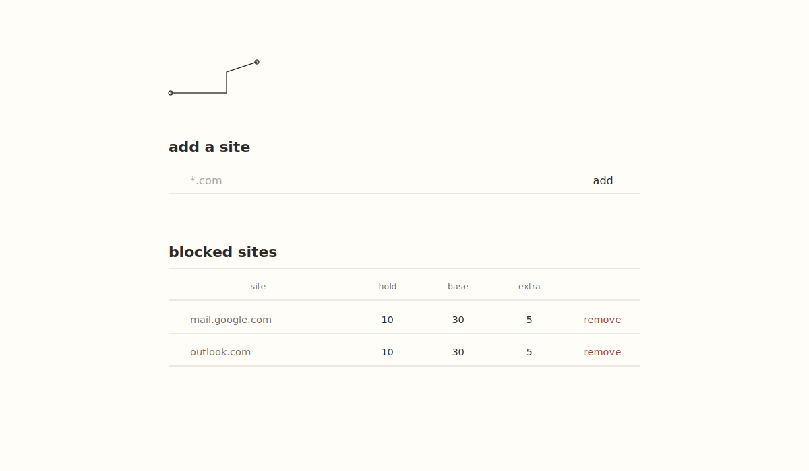

# finally-good-blocker

A deliberately small Firefox extension for blocking whole sites. A blocked site
can be opened temporarily only by holding a button long enough to earn access
time.

It targets Firefox 142 and newer.

## Interface

### Settings



### Blocking page


The default rule is:

- Hold for 10 seconds to earn 30 seconds of access.
- After the first 10 seconds, every additional second held earns 5 additional
  seconds of access.
- Access is wall-clock time, shared by every Firefox tab for that site.

Each site has its own editable copy of those three values.
While an unlocked site is active, the extension's toolbar badge counts down its
remaining access time; hover the icon for the full duration.

## Local site-time history

The extension records time spent on every hostname that has ever been added.
A visit means a matching page is the active tab in the focused Firefox window.
Switching tabs, navigating away, closing the tab, or focusing another app ends
that visit; returning starts another one. Removing a hostname from the block
list stops blocking it but deliberately keeps tracking it.

Each completed visit is kept as its own `siteVisit:<id>` record in Firefox local
extension storage, containing the configured hostname, start and end times, and
duration. The current visit is checkpointed every 30 seconds. There is not yet a
history screen or automatic pruning.

## Install temporarily in Firefox

1. Open `about:debugging` in Firefox.
2. Choose **This Firefox**.
3. Choose **Load Temporary Add-on…**.
4. Select this project's `manifest.json`.
5. Click the extension's toolbar button to open its settings.

Temporary add-ons are removed when Firefox closes. Publishing or permanent
self-installation requires signing through Mozilla Add-ons.

## Domain matching and permissions

When a domain is added, Firefox asks for permission to access only that hostname
and its subdomains. That permission is used to intercept blocked navigation and
to see when the hostname is the active tab. Removing a blocking rule retains the
permission because site-time tracking continues. For example, the requested
WebExtension match pattern for `reddit.com` is:

```text
*://*.reddit.com/*
```

The matching rule used by the blocker itself is intentionally direct:

```js
currentHostname === savedHostname ||
  currentHostname.endsWith(`.${savedHostname}`)
```

The leading dot in the second comparison means `old.reddit.com` matches while
`notreddit.com` does not. All HTTP and HTTPS paths match. If rules overlap, the
longest (most specific) saved hostname wins.

The extension compares navigation and active-tab URLs with locally saved
hostnames. It stores only the matched hostname and visit timing—not full URLs,
titles, page contents, clicks, or keystrokes. Nothing is transmitted outside
Firefox on this device. Uninstalling the extension removes its local storage.

## Development

There is no build step and there are no runtime dependencies.

```sh
npm test
npm run check
```

Create a distributable archive from the project directory with:

```sh
zip -r dist/finally-good-blocker-0.1.0.zip . \
  -x 'dist/*' -x '.git/*' -x '.DS_Store'
```

## Feature record

[`FEATURES.md`](FEATURES.md) is the living record of shipped behavior and future
ideas. Every future feature should receive an entry there as part of its change.
